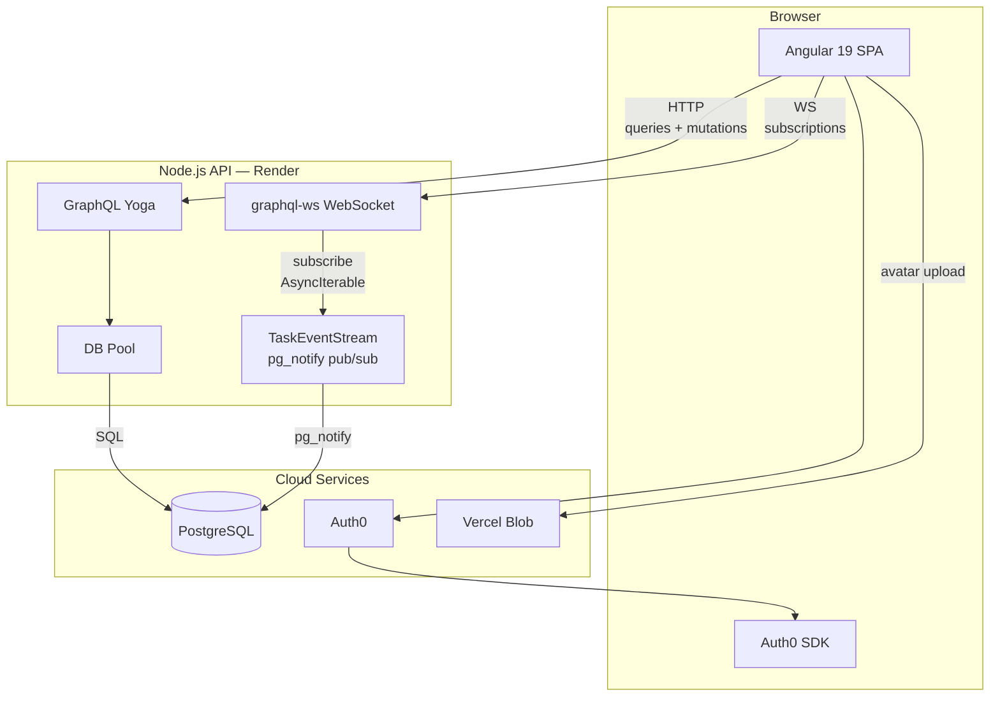
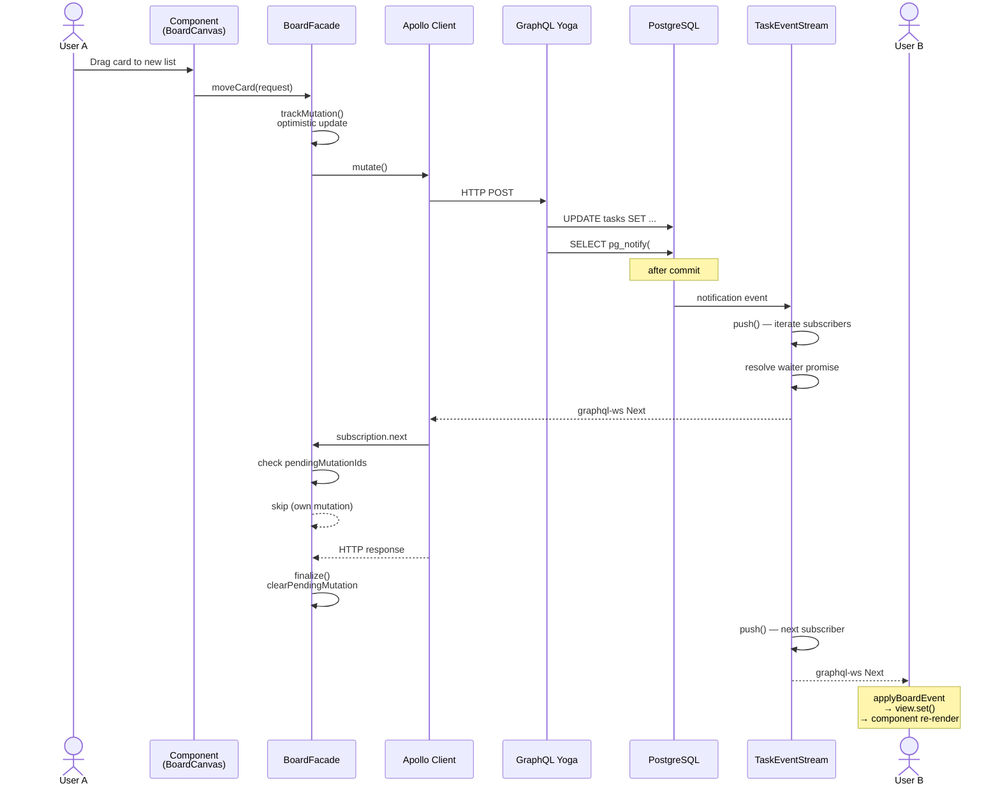
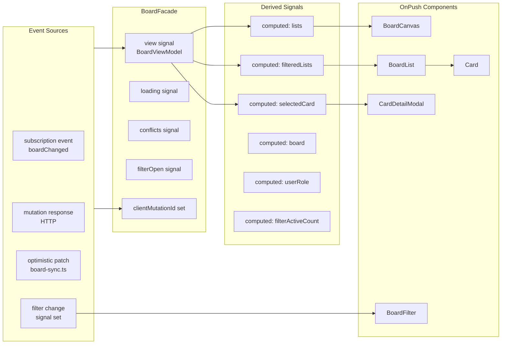

# Architecture

## State management: Signals + Apollo Cache (not NgRx)

| Choice | Rationale |
|--------|-----------|
| **Signals** | Local UI state (selection, conflicts, loading) with minimal boilerplate and OnPush integration. |
| **Apollo InMemoryCache** | Server truth for the board; optimistic local patches keep drag-and-drop instant. |
| **No NgRx** | Single board feature; a global store would add ceremony without proportional benefit. |

`BoardFacade` coordinates Apollo operations; presentation components stay dumb and OnPush.

## HTTP vs WebSocket

- **Queries & mutations** → `HttpLink` with auth context (JWT + refresh via `TokenService`).
- **Subscriptions** → `GraphQLWsLink` via `split()` on operation type.
- **Single WS client** in `create-apollo.ts`; `disposeApolloWs()` on destroy avoids duplicate connections.
- `takeUntilDestroyed()` on subscription streams in `BoardFacade`.

## Authentication

- Apollo link attaches `Authorization: Bearer` to HTTP and `connectionParams` for WebSocket.
- `authInterceptor` mirrors token injection for REST calls.
- `authGuard` and `profileGuard` protect routes.
- Tokens refreshed via Auth0 `getAccessTokenSilently` with in-memory cache and 60s skew buffer.

## Optimistic UI & rollback

1. Mutations apply optimistic local state in `BoardFacade` before the network responds.
2. On error, the facade restores the prior snapshot and shows a non-blocking toast.
3. **Simulate network drop** (header control) triggers a server-side failure window for demo/testing.

## Real-time sync & conflicts

- `boardChanged` subscription drives incremental cache updates.
- Open card modal shows a conflict banner when a remote update has a higher `version`.
- Mutations send `expectedVersion`; the server returns `conflict: true` on mismatch.

See [api.md](api.md) for subscription event shapes and cache merge rules.

## System architecture



**Key arrows:**

- **HTTP** (queries/mutations): Apollo `HttpLink` with JWT → GraphQL Yoga resolvers → `pool` → PostgreSQL.
- **WebSocket** (subscriptions): Apollo `GraphQLWsLink` → `graphql-ws` server → `TaskEventStream.subscribe()` → `AsyncIterable`.
- **Events**: Mutations call `SELECT pg_notify()` → dedicated listener Client → `push()` → resolve waiter → graphql-ws sends `Next` frame → other clients receive update.

---

## Request lifecycle



The mutating user sees the optimistic update instantly. The subscription event is skipped
on their tab via `pendingMutationIds`. Other users receive the event through the WebSocket
and apply it incrementally via `applyBoardEvent()`.

---

## Signal reactivity model



All UI state flows through `computed` signals derived from the single `view` signal.
Components use `ChangeDetectionStrategy.OnPush` and re-render only when their direct
signal dependencies change.

---

## Real-time pub/sub (Postgres LISTEN/NOTIFY)

The subscription backend is built on PostgreSQL's `LISTEN`/`NOTIFY` mechanism:

```
mutation resolver → pool.query(SELECT pg_notify('task_events', json))
                         ↓
           dedicated Client (LISTEN task_events)
                         ↓
           listener.on('notification', ...)
                         ↓
           TaskEventStream.push(event)
                         ↓
           iterate subscribers → filter → waiter.resolve()
                         ↓
           graphql-ws → WebSocket → Apollo → signal
```

### TaskEventStream internals

`TaskEventStream` (`server/src/subscriptions/task-events.ts`) owns:

| Component | Role |
|-----------|------|
| **listener** `Client` | Dedicated PG connection with `LISTEN task_events`. Receives notifications. |
| **publisher** `Client` | Separate dedicated PG connection for `SELECT pg_notify()`. Avoids pool contention. |
| **subscribers** `Set` | Active subscribers, each with a `filter` function and an event `queue`. |
| **waiters** array | Pending `.next()` calls from the `AsyncIterable` — resolved when a matching event arrives. |

A subscription (e.g. `boardChanged(boardId: "abc")`) creates a subscriber with a filter:

```typescript
(event) =>
  event.boardChanged?.boardId === "abc"
    ? { boardChanged: event.boardChanged }
    : null
```

When `push(event)` is called:
1. Each subscriber's filter is run against the event.
2. If the filter returns a value, the subscriber's waiter (if any) is resolved immediately.
3. If no waiter is pending, the event is queued for the next `.next()` call.

This is a classic **push/pull** pattern — no polling, no debouncing, no batching.
End-to-end latency is typically <5ms from `pg_notify` to WebSocket send.

---

## Performance

- `ChangeDetectionStrategy.OnPush` on presentation components.
- Lazy-loaded routes: login, callback, dashboard, profile flows.
- Production budgets in `client/angular.json`.
